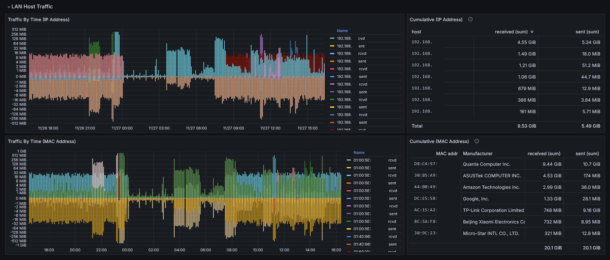

# ntopng-grafana
Long term traffic statistics on a Raspberry Pi running OpenWRT, from ntopng, viewed in grafana via influxdb.

While these instructions are specifically for a Raspberry Pi 4 running *OpenWRT 23.05.4*, they may be applicable to other devices and versions. Either way, it is your responsibility to evaluate and accept any risk involved in this process.
## Motivation
While [OpenWRT](https://openwrt.org/) does provide [several options](https://openwrt.org/docs/guide-user/services/network_monitoring/bwmon) for bandwidth monitoring, the available options focus on devices within the local network. Information regarding external services accessed by local devices is rather limited.

[ntopng](https://www.ntop.org/guides/ntopng/what_is_ntopng.html) provides some transparency into the goings-on in your network. However, the available data is limited to active flows. Access to historical data is paywalled.

ntopng does support exporting timeseries data to [InfluxDB](https://www.influxdata.com/products/influxdb-overview/), in essence, making it possible to view historical data through a graphing tool such as [Grafana](https://grafana.com/).

## Grafana Dashboard
The dashboard definition, by itself, located at `grafana-dashboard/ntopng - Long Term - xxxxxxxxxxxxx.json` in this repository, should be usable on pretty much any hardware/software combination as long as you can get the ntopng - influxdb pipeline running.

If you only want to use the dashboard, skip to the [Configuration](#configuration) section.
### Screenshots




## Prerequisites
- Raspberry Pi 4 (or other **arm64** computer) running OpenWRT (installation instructions [here](https://openwrt.org/toh/raspberry_pi_foundation/raspberry_pi))
- LAN and internet access from the OpenWRT RPi4
- SSH enabled ***or*** a keyboard and display connected to your RPi4
- Familiarity with the linux command line, SSH and *docker*
## Mounting external storage on /opt
In the `squashfs` version of OpenWRT, for some reason, trying to run the ntopng container off the f2fs overlay, results in a `Error response from daemon: invalid argument` error.

The `docker` package available via `opkg`, stores data at the location `/opt/docker`. Therefore, I mounted writable storage at `/opt` _before_ installing docker (ref. [Using storage devices](https://openwrt.org/docs/guide-user/storage/usb-drives)).

I chose to split the second partition on my SD card into two, format the third partition as `ext2` and mount that partition as `/opt`. This is not the best idea for SD card longevity since InfluxDB will be writing logs frequently. It is up to you to evaluate whether adding a USB HDD or SSD makes sense for your use case.
## Clone this repository
Connect a keyboard and display to your RPi4 *or* log in via SSH and clone this repository
```
opkg update
opkg install git git-http
cd /opt
git clone https://github.com/singhaxn/ntopng-grafana.git
```
## Getting docker to work
Getting docker to a usable state, on OpenWRT, was non-trivial. So, I'm documenting the process here, for reference.
### Installing docker
Install `docker` and `docker-compose` from the web interface or by running the following commands in the shell:
```
opkg install dockerd docker docker-compose
```
Alternatively, you could spin up `portainer` instead of installing `docker-compose`, if you prefer a web-based interface for managing your containers.
```
docker pull portainer/portainer-ce:latest
docker run -d \
        -p 8000:8000 \
        -p 9443:9443 \
        --name portainer \
        --restart=always \
        -v /var/run/docker.sock:/var/run/docker.sock \
        -v /opt/portainer:/data \
        --network=bridge \
        portainer/portainer-ce:latest
```
**Note**: If you encounter issues, try using `--network=host` instead of `--network=bridge`
### Updating the firewall
At this point, a rule for *docker* should have been added to your firewall. However, you will only have access to containers running in `host` network mode. In other words, if you've installed `portainer` with `--network=bridge`, its UI will not be accessible.

The configuration described here will allow you to access containers with network mode `bridge` from your LAN. However, given my limited familiarity with firewall rules, the best configuration I have been able to whip up so far, has the following limitations:
1. Containers in `bridge` network mode will have no WAN (internet) access
2. Containers on a network other than `host` or `bridge` will not be accessible from outside

To allow access to containers in `bridge` mode:
1. In the OpenWRT web interface (*LuCI*), navigate to *Network > Firewall*. The *Zones* section should look somewhat like this:
	- 
2. Click the *Edit* button for the `docker` rule and change the *Allow forward to destination zones* and *Allow forward from source zones* options to include the `lan` interface.
	- 
3. Click *Save*, followed by *Save & Apply*

At this point, you should be able to access containers with network mode `host` or `bridge` from your LAN.
## Start the ntopng stack
### Install dependencies
```
opkg install unzip sqlite3-cli
cd /opt/ntopng-grafana/scripts
chmod +x *.sh
./install-deps.sh
```
`install-deps.sh` internally calls `update-luts.sh` which pulls ASN and OUI mappings and creates look-up tables in an sqlite3 database.
### Build the ntopng image
*ntop* does provide a [docker image](https://hub.docker.com/r/ntop/ntopng_arm64.dev) for ntopng on arm64 devices. However, for me, pulling this image on an OpenWRT RPi4 fails with the following error:
```
failed to register layer: lsetxattr security.capability /usr/lib/aarch64-linux-gnu/gstreamer1.0/gstreamer-1.0/gst-ptp-helper: operation not supported
```
So, let us build an image instead:
```
cd /opt/ntopng-grafana
docker compose build --progress=plain ntopng
```
### Start the ntopng stack
Make sure, the interfaces specified in `docker-compose.yml` under `services > ntopng > command` are the ones you want to monitor. Then run:
```
docker compose pull
docker compose up -d
```
## Configuration
### Dashboard only
If you've skipped the the previous sections because you only want to use the dashboard in your setup, make sure you perform the following actions before proceeding:
1. Clone this repository
	```
	git clone https://github.com/singhaxn/ntopng-grafana.git
	```
2. Install the [sqlite plugin](https://grafana.com/grafana/plugins/frser-sqlite-datasource/) for grafana.
3. Mount some directory as `/custom` in your grafana container.
4. Modify the path following line in `update-luts.sh` to target the directory mounted as `/custom`:
	```
	cd "$SRCDIR/grafana/custom"
	```
5. Run `update-luts.sh` to create sqlite look-up tables for ASNs an OUIs
	```
	chmod +x update-luts.sh
	./update-luts.sh
	```
At this point, it is assumed that you have your `redis`, `influxdb`, `ntopng` and `grafana` containers running and accessible as required. Make sure you adjust the URLs below, to match your setup.
### ntopng
Access the ntopng web UI (version `6.1.240628-23672` at the time of writing) by going to `http://<RPi4_IP_address>:3000` in your browser. The default username/password combination is `admin`/`admin`. Change the password and then you should be redirected to the ntopng dashboard.

At this point, let's start exporting flow data to InfluxDB.
#### Export flows to InfluxDB
Within the ntopng web interface, navigate to *Settings > Timeseries*. I've made the following changes to collect data for the included Grafana dashboard.
1. **Timeseries Database**
	1. **Timeseries Driver**: `InfluxDB 1.x/2.x`
	2. **InfluxDB URL**: `http://localhost:8086`
	3. **Timeseries/Stats Data Retention**: `60`
2. **Interfaces Timeseries**
	1. **Layer-7 Applications**: `None`
3. **Local Hosts Timeseries** (optional)
	1. **Host Timeseries**: `Full` - Only if you want to monitor DNS request statistics
4. **Devices Timeseries**
	1. **Traffic**: `On`
5. **Other Timeseries**
	1. **Autonomous Systems**: `On`
	2. **Countries**: `On`
#### Screenshots for reference


### Grafana

Access the grafana web UI (version `11.2.0` at the time of writing) by going to `http://<RPi4_IP_address>:3001` in your browser. The default username/password combination is `admin`/`admin`. Change the password and then you should be redirected to the grafana home page.
#### Timeseries datasource (InfluxDB)
1. Navigate to *Connections > Add new connection* and select *InfluxDB*.
2. Click *Add new datasource*
3. Change the following properties
	- **Name**: `ntopng`
	- **HTTP**
		- **URL**: `http://localhost:8086/`
	- **InfluxDB Details**
		- **Database**: `ntopng`
			- or whatever you've configured in the ntopng web UI above
4. Click *Save & test* 
5. Verify that your datasource has been added under *Connections > Datasources* in the left navigation panel.

#### Lookup tables (SQLite)
1. Navigate to *Connections > Add new connection* and select *SQLite*.
2. Click *Add new datasource*
3. Change the following properties
	- **Name**: `ntopng-luts`
	- **Path**: `/custom/lut.sqlite3`
4. Click *Save & test*
5. Verify that your datasource has been added under *Connections > Datasources* in the left navigation panel.
 
#### Import the ntopng Long-term Dashboard
1. Navigate to *Dashboards*, click *New > Import*
2. Upload the `grafana-dashboard/ntopng - Long Term - xxxxxxxxxxxxx.json` file from this repository
	-  **Note**: Since your browser is not running on the RPi4, where you cloned this repository, you will have to acquire this single file, separately, in order to upload it to grafana
3. Choose the InfluxDB and SQLite datasources you created earlier
4. Click *Import*

You should now have a functional Grafana dashboard for long-term ntopng data.

## Notes

- Since docker doesn't guarantee the order in which containers start on boot, at times, ntopng may fail to discover influxdb at start-up. Therefore, it makes sense restart the `ntopng` stack on boot. The `scripts/on-boot.sh` script can be used to achieve this. Normally, this could be done by adding an `@reboot` instruction to our crontab. However, OpenWRT [doesn't support time shortcuts](https://openwrt.org/docs/guide-user/base-system/cron#task_specification) out-of-the-box.  As an alternative, edit `/etc/rc.local` and add the following line before `exit 0`
```
/opt/ntopng-grafana/scripts/on-boot.sh &
```
- If you want to update the LUTs periodically, you can use `cron` to call `scripts/update-luts.sh`, say, once a month by adding the following line to your `crontab` (command `crontab -e`)
```
0 0 1 * * /opt/ntopng-grafana/scripts/update-luts.sh
```

## References

- ASN mappings from https://github.com/sapics/ip-location-db
- OUI mappings from https://standards-oui.ieee.org
