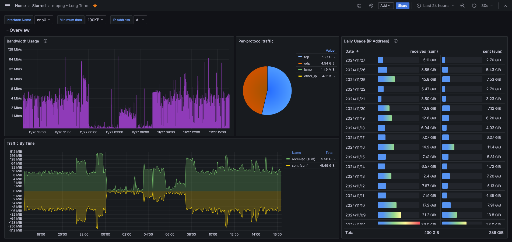
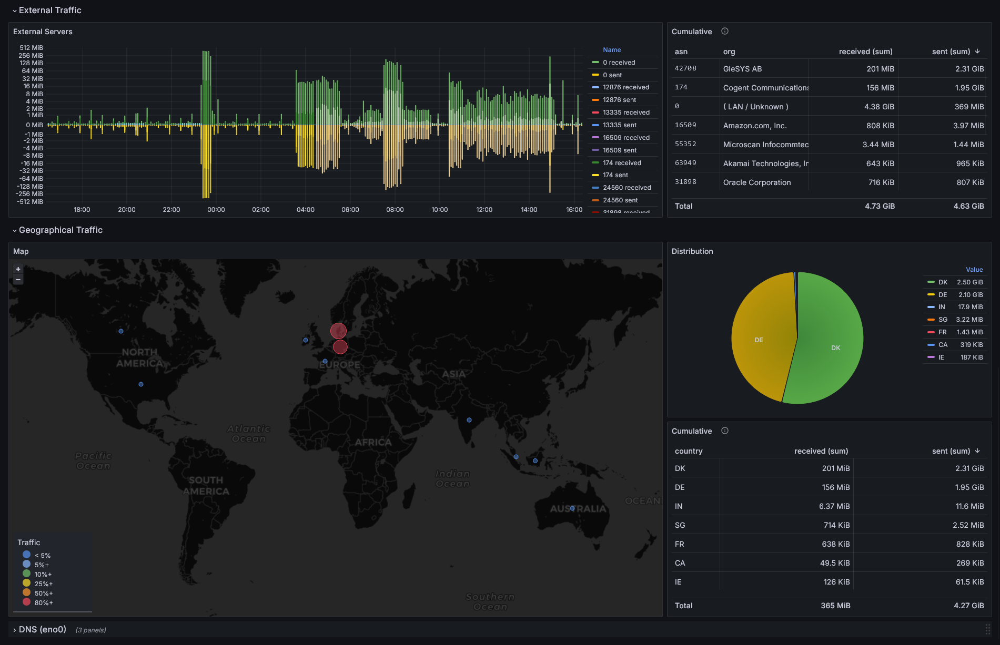

# ntopng-grafana
Long term traffic statistics from ntopng, viewed in grafana via influxdb.
## Motivation
[ntopng](https://www.ntop.org/guides/ntopng/what_is_ntopng.html) provides some transparency into the goings-on in your network. However, the available data is limited to active flows and access to historical data is paywalled. ntopng does support exporting timeseries data to [InfluxDB](https://www.influxdata.com/products/influxdb-overview/), in essence, making it possible to view historical data through a visualization tool such as [Grafana](https://grafana.com/).
## Grafana Dashboard
### Screenshots




## Disclaimer
If you choose to use this repository, it is your responsibility to evaluate and accept any risk involved.
## OpenWRT
If your target platform is OpenWRT, follow the instructions [here](README.owrt.md) and then jump to the [Configuration](#configuration) section below.
## Prerequisites
- Command line access on the target device (SSH ***or*** keyboard and display)
- Internet access from the target device
- Familiarity with the linux command line, SSH and docker
- The following command line tools pre-installed:
	- `git`
	- `wget`
	- `unzip`
	- [`docker`](https://docs.docker.com/engine/install/) and `docker compose`
	- `sqlite3`
## Clone this repository
Log in to the target device via SSH *or* connect a keyboard and display and clone this repository
```bash
git clone https://github.com/singhaxn/ntopng-grafana.git
```
Henceforth, let's refer to the repository directory as `<ntopng-grafana>`
## Start services
### Install dependencies
```bash
cd <ntopng-grafana>
chmod +x scripts/*.sh
scripts/install-deps.sh
```
`install-deps.sh` internally calls `update-luts.sh` which pulls [Autonomous System Number (ASN)](https://en.wikipedia.org/wiki/Autonomous_system_(Internet)) and [Organizationally Unique Identifier (OUI)](https://en.wikipedia.org/wiki/Organizationally_unique_identifier) mappings and creates look-up tables in an sqlite3 database.

### Update configuration
For simplicity, let's create a `docker-compose.yml` link to the appropriate compose file:
```bash
ln -s docker-compose.default.yml docker-compose.yml
```
In `docker-compose.yml` under `services > ntopng > command`, make sure, the specified interfaces (`-i`), are the ones you want to monitor. You can add more interfaces if you want, for example:
```yaml
..., "-i", "br-lan", "-i", "eth0", "-i", "eth1",...
```
For `arm64` (*untested*), under `services > ntopng`, choose the `ntop/ntopng_arm64.dev:latest` image instead of `ntop/ntopng:stable`:
```yaml
services:
	...
	ntopng:
		# image: ntop/ntopng:stable
		image: ntop/ntopng_arm64.dev:latest
	...
```
The exposed TCP ports are:
|service|port|comments|
|-|-|-|
|`redis`|6379|`services > redis > ports`|
|`influxdb`|8086|`services > influxdb > ports`|
|`grafana`|3003|`services > grafana > ports`|
|`ntopng`|3002|`services > ntopng > command`|

Please choose unused TCP ports, as appropriate for your environment, and substitute accordingly, in the configuration instructions.

### Start the ntopng stack
In the repository base folder (`ntopng-grafana`), run:
```bash
docker compose pull
docker compose up -d
```
Please be patient, this may take a little time.
## Configuration
### ntopng
Access the ntopng web UI (version `6.2` at the time of writing) by going to `http://<device_IP_address>:3002` in your browser. The default username/password combination is `admin`/`admin`. Change the password and then you should be redirected to the ntopng dashboard.
#### Export flows to InfluxDB
Within the ntopng web interface, navigate to *Settings > Preferences > Timeseries*. Make the following changes to collect data for the included Grafana dashboard.
1. **Timeseries Database**
	1. **Timeseries Driver**: `InfluxDB 1.x/2.x`
	2. **InfluxDB URL**: `http://localhost:8086`
	3. **Timeseries/Stats Data Retention** (optional): `60`
2. **Interfaces Timeseries**
	1. **Layer-7 Applications**: `None`
3. **Local Hosts Timeseries**
	1. **Host Timeseries** (one of):
		- `Light` - default
		- `Full` - only if you want to monitor DNS request statistics
4. **Devices Timeseries**
	1. **Traffic**: `On`
5. **Other Timeseries**
	1. **Autonomous Systems**: `On`
	2. **Countries**: `On`
#### Screenshots for reference


### Grafana

Access the grafana web UI (version `11.2.0` at the time of writing) by going to `http://<device_IP_address>:3003` in your browser. The default username/password combination is `admin`/`admin`. Change the password and then you should be redirected to the grafana home page.
#### Timeseries datasource (InfluxDB)
1. Navigate to *Connections > Add new connection* and select *InfluxDB*.
2. Click *Add new datasource*
3. Change the following properties
	1. **Name**: `ntopng`
	2. **HTTP**
		1. **URL** (one of):
			- `http://localhost:8086/` - OpenWRT
			- `http://influxdb:8086/` - other platforms
	3. **InfluxDB Details**
		1. **Database**: `ntopng`
4. Click *Save & test* 
5. Verify that your datasource has been added under *Connections > Datasources* in the left navigation panel.

#### Lookup tables (SQLite)
1. Navigate to *Connections > Add new connection* and select *SQLite*.
2. Click *Add new datasource*
3. Change the following properties
	1. **Name**: `ntopng-luts`
	2. **Path**: `/custom/lut.sqlite3`
4. Click *Save & test*
5. Verify that your datasource has been added under *Connections > Datasources* in the left navigation panel.
 
#### Import the ntopng Long-term Dashboard
1. Navigate to *Dashboards*, click *New > Import*
2. Upload the `grafana-dashboard/ntopng - Long Term - xxxxxxxxxxxxx.json` file from this repository
	-  **Note**: If your browser is not running on the same host, where you cloned this repository, you will have to acquire this single file, separately, in order to upload it to grafana
3. Choose the InfluxDB (`ntopng`) and SQLite (`ntopng-luts`) datasources you created earlier
4. Click *Import*

#### Map your network interface names
1. Navigate to *Dashboards* and choose *ntopng - Long Term*
2. Navigate to *Dashboard settings* by clicking the *cog icon* (&#x2699;)
3. Go to *Variables > iface_name*. This variable corresponds to the *Interface Name* dropdown on the dashboard.
4. Under *Custom Options* enter the `name : index` pairs for the interfaces you're monitoring. The order must match the specification under `services > ntopng > command` in `docker-compose.yml`. The format **must** be:
	```
	<interface_name_1> : 0,<interface_name_2> : 1,<interface_name_3> : 2,...
	```
	Please follow this formatting precisely. Grafana doesn't tolerate missing or extra spaces.
	The names are purely for your reference. However, the numbers after the colon (:) must be sequential, starting with 0.
	

<!--	Since the order in which ntopng exports interfaces is not defined, it may take some trial and error to figure out which numeric ID corresponds to which interface. -->
5. Verify that the *Preview of values* section only shows the interface names.

<!--	 -->
6. Click *Apply* and then *Save Dashboard*

You should now have a functional Grafana dashboard for long-term ntopng data.

## Notes

- If you want to update the LUTs periodically, you can use `cron` to call `scripts/update-luts.sh`, say, once a month by adding the following line to your `crontab` (command `crontab -e`)
	```
	0 0 1 * * <ntopng-grafana>/scripts/update-luts.sh
	```
- Since docker doesn't guarantee the start order of containers on boot, at times, ntopng may fail to discover influxdb at start-up. Therefore, it makes sense restart the `ntopng` stack on boot. The `scripts/on-boot.sh` script can be used to do this.

	Normally, this can be achieved by adding an `@reboot` instruction to our crontab:
	```
	@reboot <ntopng-grafana>/scripts/on-boot.sh
	```
	OpenWRT, however, [doesn't support time shortcuts](https://openwrt.org/docs/guide-user/base-system/cron#task_specification) out-of-the-box. As an alternative, edit `/etc/rc.local` and add the following line ***before*** `exit 0`
	```
	/opt/ntopng-grafana/scripts/on-boot.sh &
	```
## References

- ASN mappings from https://github.com/sapics/ip-location-db
- OUI mappings from https://standards-oui.ieee.org
