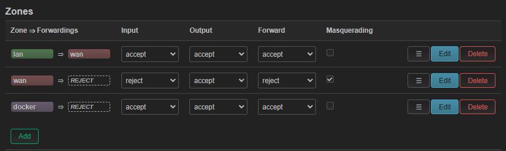

# ntopng-grafana (OpenWRT)
While [OpenWRT](https://openwrt.org/) does provide [several options](https://openwrt.org/docs/guide-user/services/network_monitoring/bwmon) for bandwidth monitoring, the available options focus on devices within the local network. Information regarding external services accessed by local devices is rather limited.

[ntopng](https://www.ntop.org/guides/ntopng/what_is_ntopng.html) provides some transparency into the goings-on in your network. However, the available data is limited to active flows. Access to historical data is paywalled. ntopng does support exporting timeseries data to [InfluxDB](https://www.influxdata.com/products/influxdb-overview/), in essence, making it possible to view historical data through a visualization tool such as [Grafana](https://grafana.com/).

The configuration described here, has only been tested on OpenWRT running on a Raspberry Pi 4. It may, however, be usable on other `arm64` devices too.

If you're targeting OpenWRT on an `amd64` device, specifying the correct package [for your platform](https://packages.ntop.org/), in `build/ntopng/setup/install.sh` may do the trick:

change
```bash
PACKAGE=https://packages.ntop.org/RaspberryPI/apt-ntop.deb
```
to
```bash
PACKAGE=https://packages.ntop.org/apt-stable/bullseye/all/apt-ntop-stable.deb
```

## Disclaimer
If you choose to use this repository, it is your responsibility to evaluate and accept any risk involved.
## Prerequisites
- Raspberry Pi 4 (or other **arm64** computer) running OpenWRT (installation instructions [here](https://openwrt.org/toh/raspberry_pi_foundation/raspberry_pi))
- LAN and internet access from the OpenWRT RPi4
- SSH enabled ***or*** a keyboard and display connected to your RPi4
- Familiarity with the linux command line, SSH and docker
## Mounting external storage at /opt
The `docker` package available via `opkg`, stores data at the location `/opt/docker`. On the `squashfs` version of OpenWRT, for some reason, trying to run an ntopng container off the f2fs overlay, results in an `Error response from daemon: invalid argument` error. We can get around the f2fs problem by mounting writable storage at `/opt` _before_ installing docker (ref. [Using storage devices](https://openwrt.org/docs/guide-user/storage/usb-drives)).

I chose to split the second partition on my SD card into two, format the third partition as `ext2` and mount that partition as `/opt`. This is not the best idea for SD card longevity since InfluxDB will be writing logs frequently. It is up to you to evaluate whether adding a USB HDD or SSD makes sense for your use case.
## Install required packages
Connect a keyboard and display to your RPi4 *or* log in via SSH and install the required packages:
<!--wget?-->
```bash
opkg update
opkg install git git-http dockerd docker docker-compose unzip sqlite3-cli
```
## Clone this repository
```bash
cd /opt
git clone https://github.com/singhaxn/ntopng-grafana.git
```
## Getting docker to work
Getting docker to a usable state, on OpenWRT, was non-trivial and undocumented. So, I'm noting down the process here, for reference.
### Update the firewall
Once docker is installed, a rule for *docker* should have been added to your firewall. However, only containers running in `host` network mode will be accessible externally.

The configuration described here will allow you to access containers with network mode `bridge` from your LAN. However, given my limited familiarity with firewall rules, the best configuration I have been able to whip up so far, has the following limitations:
1. Containers in `bridge` network mode will have no WAN (internet) access
2. Containers on a network other than `host` or `bridge` will not be accessible from outside

To allow access to containers in `bridge` mode:
1. In the OpenWRT web interface (*LuCI*), navigate to *Network > Firewall*. The *Zones* section should look somewhat like this:
	- 
2. Click the *Edit* button for the `docker` rule and change the *Allow forward to destination zones* and *Allow forward from source zones* options to include the `lan` interface.
	- 
3. Click *Save*, followed by *Save & Apply*

At this point, you should be able to access containers with network mode `host` or `bridge` from your LAN.
## Start services
### Install dependencies
```
cd /opt/ntopng-grafana
chmod +x scripts/*.sh
scripts/install-deps.sh
```
`install-deps.sh` internally calls `update-luts.sh` which pulls [autonomous system number (ASN)](https://en.wikipedia.org/wiki/Autonomous_system_(Internet)) and [organizationally unique identifier (OUI)](https://en.wikipedia.org/wiki/Organizationally_unique_identifier) mappings and creates look-up tables in an sqlite3 database.
### Update configuration
For simplicity, let's create a `docker-compose.yml` link to the appropriate compose file:
```bash
ln -s docker-compose.owrt.yml docker-compose.yml
```
In `docker-compose.yml` under `services > ntopng > command`, make sure, the specified interfaces (`-i`), are the ones you want to monitor. You can add more interfaces if you want, for example:
```yaml
..., "-i", "br-lan", "-i", "eth0", "-i", "eth1",...
```
The exposed TCP ports are:
|service|port|comments|
|-|-|-|
|`redis`|6379|`services > redis > ports`|
|`influxdb`|8086|`services > influxdb > ports`|
|`grafana`|3003|`services > influxdb > ports`, `services > grafana > environment > GF_SERVER_HTTP_PORT`|
|`ntopng`|3002|`services > ntopng > command`|

Please choose unused TCP ports, as appropriate for your environment, and substitute accordingly, in the configuration instructions.
### Build the ntopng image
*ntop* does provide a [docker image](https://hub.docker.com/r/ntop/ntopng_arm64.dev) for ntopng on arm64 devices. However, for me, pulling this image on an OpenWRT RPi4 fails with the following error:
```
failed to register layer: lsetxattr security.capability /usr/lib/aarch64-linux-gnu/gstreamer1.0/gstreamer-1.0/gst-ptp-helper: operation not supported
```
So, let us build an image instead:
```bash
cd /opt/ntopng-grafana
docker compose build --progress=plain ntopng
```
### Start the ntopng stack
```bash
docker compose pull
docker compose up -d
```
Please be patient, this may take a little time.
### Return to the [Configuration](README.md#configuration) section.